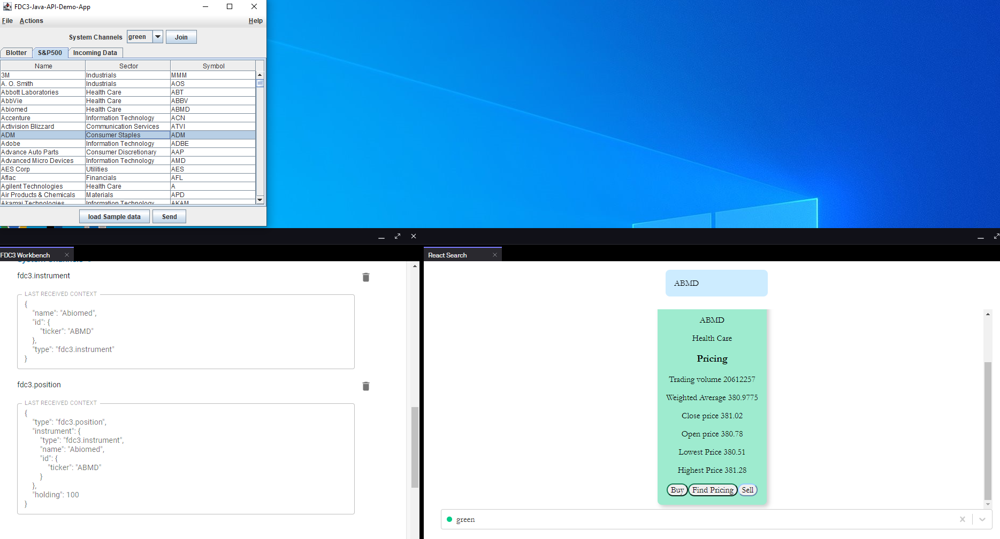

# FDC3 Java API

Standardized Java API to enable integration of FDC3 for Java Desktop Applications.

## Installation & Development Setup

Prerequisite: Java 11

#### FDC3 Java API

In a new terminal, navigate to the `fdc3api` directory

Build Project

```sh
mvn clean compile
```

#### FDC3 Container

In a new terminal, navigate to the `fdc3container` directory

Install Dependencies

```sh
npm i
```

Run Application

```sh
npm start
```

Runs on <localhost:8080>

#### Client

In a new terminal, navigate to the `client` directory

Build Project:

```sh
mvn clean compile package
```

Run the executable from Target directory

```sh
java -jar <Project.baseDirectory>\client\target\client-1.0.0-SNAPSHOT.jar
  ```

#### Stock Search React Receiver Application

In a new terminal, navigate to the `fdcreceiver-react-trade-app` directory

Install Dependencies

```sh
npm i
```

Run Application

```sh
npm start
```

Runs on <localhost:3000>

## Usage with the Current State of this Repo

With the goal of our use case being to enable integration of FDC3 for Java Desktop Applications, we developed the Java API in addition to several simple applications that demonstrate its functionality and potential. The components we developed are as follows:

* Java API - Our implementation of the Java API. Located in `fdc3api`
* Java Swing Sender - Client application to place orders. Located in `client`
* Adapter - the OpenFin Adapter. Located in `openfin-fdc3-adapter`
* Trade App - React based application enabled for receiving trade context from the sender. Located in `fdcreceiver-react-trade-app`
* FDC3 Container - OpenFin based container hosting the receiver environment. Located in `fdc3container`

As you interact with these applications, you will see our API in action. For example, say the user were to send the instruments from the Java Swing blotter, this action would then be reflected across the receiving web applications. In addition, we implemented a feature to allow the user to select what channel they are listening on to demonstrate the potential of our API.



## Usage in a Business Environment

Some firms have existing Java desktop applications, and they want to use FDC3 to integrate with other apps that use JavaScript or other technologies.

For example, a buy-side trader using an internal Java order management system selects an order on their blotter and wants to view related analytics in an external JavaScript app provided by a broker.

This API will provide a standardized API for Java app developers to use, making it easier to switch the underlying technology that provides the FDC3 communication if required. By leveraging our FDC3 Java API in existing apps, developers will be able to create a user friendly workflow that favors shared context between applications as opposed to manual repetition by the user.

## Roadmap

1. Robust testing
2. Acceptance as a FINOS standard
3. The FDC3 Java API is leveraged in a production environment
4. Review with OpenFin the FDC3 features not currently supported by their Java API. Discuss if they would be willing to implement this FDC3 Java API directly instead of using an adapter.
5. If possible, write a fully open-source implementation of the API without any dependency on a specific desktop agent vendor. This may be possible using websocket with the new desktop agent bridging spec.

## Contributing

1. Fork it (<https://github.com/finos-labs/fdc3-java-api/fork>)
2. Create your feature branch (`git checkout -b feature/fooBar`)
3. Read our [contribution guidelines](.github/CONTRIBUTING.md) and [Community Code of Conduct](https://www.finos.org/code-of-conduct)
4. Commit your changes (`git commit -am 'Add some fooBar'`)
5. Push to the branch (`git push origin feature/fooBar`)
6. Create a new Pull Request

_NOTE:_ Commits and pull requests to FINOS repositories will only be accepted from those contributors with an active, executed Individual Contributor License Agreement (ICLA) with FINOS OR who are covered under an existing and active Corporate Contribution License Agreement (CCLA) executed with FINOS. Commits from individuals not covered under an ICLA or CCLA will be flagged and blocked by the FINOS Clabot tool. Please note that some CCLAs require individuals/employees to be explicitly named on the CCLA.

*Need an ICLA? Unsure if you are covered under an existing CCLA? Email [help@finos.org](mailto:help@finos.org)*

## License

Copyright 2023 Wellington Management Company LLP

Distributed under the [Apache License, Version 2.0](http://www.apache.org/licenses/LICENSE-2.0).

SPDX-License-Identifier: [Apache-2.0](https://spdx.org/licenses/Apache-2.0)
