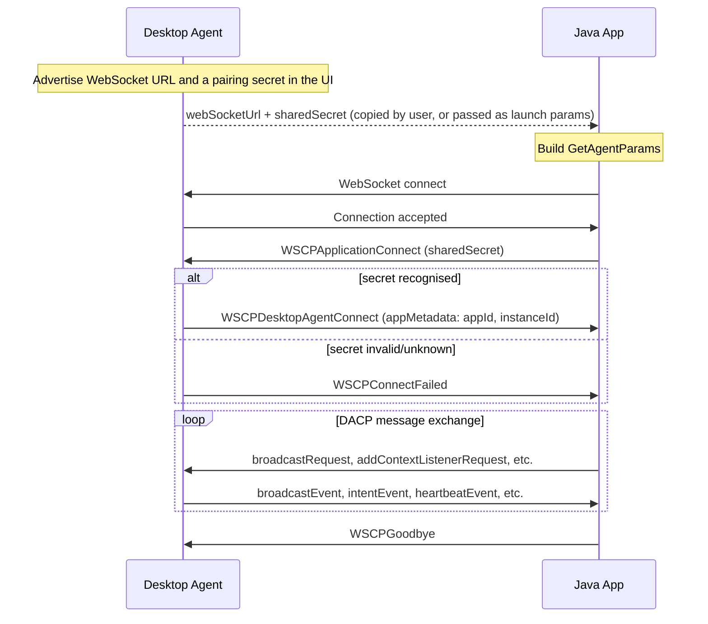

[](https://community.finos.org/docs/governance/lifecycle-stages/incubating)

# FDC3 Java API

A Java implementation of the [FDC3 Standard](https://fdc3.finos.org/) enabling Java desktop applications to interoperate with other FDC3-enabled applications via the [Desktop Agent Communication Protocol (DACP)](https://fdc3.finos.org/docs/api/specs/desktopAgentCommunicationProtocol).


```mermaid
sequenceDiagram
    participant DA as Desktop Agent
    participant App as Java App

    Note over DA: Advertise WebSocket URL and a pairing secret in the UI
    DA-->>App: webSocketUrl + sharedSecret (copied by user, or passed as launch params)
    Note over App: Build GetAgentParams

    App->>DA: WebSocket connect
    DA->>App: Connection accepted
    App->>DA: WSCPApplicationConnect (sharedSecret)

    alt secret recognised
        DA->>App: WSCPDesktopAgentConnect (appMetadata: appId, instanceId)
    else secret invalid/unknown
        DA->>App: WSCPConnectFailed
    end

    loop DACP message exchange
        App->>DA: broadcastRequest, addContextListenerRequest, etc.
        DA->>App: broadcastEvent, intentEvent, heartbeatEvent, etc.
    end

    App->>DA: WSCPGoodbye
```

**App identity flow:** this project implements the [WebSocket Connection Protocol (WSCP)](https://fdc3.finos.org/docs/api/specs/webSocketConnectionProtocol), which is how an application outside the browser connects to a Desktop Agent. It is a different protocol from the browser-resident Web Connection Protocol (WCP), and none of the WCP concepts — iframes, `identityUrl` origin matching, `instanceUuid` — apply here.

Identity rests on a **pairing secret**. The Desktop Agent generates a secret and makes it available to the user together with its WebSocket URL, typically by displaying both in its UI; how it does this is up to the agent. The application supplies the two values in `GetAgentParams` and sends the secret in `WSCPApplicationConnect`. The Desktop Agent checks the secret and replies with `WSCPDesktopAgentConnect` carrying the `appId` and `instanceId` it has assigned, or rejects the connection with `WSCPConnectFailed`. The assigned identity is then available through `getInfo()`. After the handshake, all FDC3 API calls travel as DACP messages over the same WebSocket.

## Overview

This project provides:

- **FDC3 Standard API interfaces** — Java equivalents of the FDC3 TypeScript API
- **Desktop Agent Proxy** — Client-side implementation that communicates with a Desktop Agent over WebSocket
- **GetAgent factory** — Simple entry point for connecting to a Desktop Agent
- **Cucumber testing framework** — Shared step definitions for conformance testing against the official FDC3 feature files

## Modules

| Module             | Description                                                                     |
| ------------------ | ------------------------------------------------------------------------------- |
| `fdc3-standard`    | Core FDC3 API interfaces (`DesktopAgent`, `Channel`, `Context`, `Intent`, etc.) |
| `fdc3-schema`      | Generated schema types and JSON conversion utilities                            |
| `fdc3-context`     | Context type conversion utilities                                               |
| `fdc3-agent-proxy` | `DesktopAgentProxy` implementation using DACP messaging                         |
| `fdc3-get-agent`   | `GetAgent` factory for obtaining a `DesktopAgent` connection via WebSocket      |

## Requirements

- Java 17 or later
- Maven 3.6+
- A running FDC3 Desktop Agent that supports the [Desktop Agent Communication Protocol](https://fdc3.finos.org/docs/api/specs/desktopAgentCommunicationProtocol) (e.g., [FDC3 Sail](https://github.com/finos/FDC3-Sail))

Building additionally requires **network access to the npm registry**, and no Node installation
of your own. See below.

## Installation

### Building from Source

```sh
mvn clean install
```

### Maven Dependency

Once published, add to your `pom.xml`:

```xml
<dependency>
    <groupId>org.finos.fdc3</groupId>
    <artifactId>fdc3-get-agent</artifactId>
    <version>1.0.0-SNAPSHOT</version>
</dependency>
```

## Usage

### Connecting to a Desktop Agent

```java
import org.finos.fdc3.api.DesktopAgent;
import org.finos.fdc3.getagent.GetAgent;
import org.finos.fdc3.getagent.GetAgentParams;

// Both values come from the Desktop Agent, which normally shows them in its UI.
GetAgentParams params = GetAgentParams.builder()
    .webSocketUrl("wss://desktop-agent.example.com/fdc3/ws") // required
    .sharedSecret(pairingSecret)                             // required
    .channelSelector(myChannelSelector)                      // optional
    .intentResolver(myIntentResolver)                        // optional
    .build();

DesktopAgent agent = GetAgent.getAgent(params).toCompletableFuture().get();
```

The connection is a WebSocket, so `webSocketUrl` must use the `wss` scheme. Plain `ws` is
rejected unless the host is a loopback address, because the pairing secret and every
subsequent message would otherwise cross the network in the clear. To use `ws` against a
non-loopback host during development, opt in explicitly with
`.allowInsecureTransport(true)`.

#### Handling the pairing secret

The pairing secret is a bearer credential: anything holding it can connect to the Desktop
Agent as your application. Treat it accordingly.

- Do not commit it, and do not write it to a log or an error message. This library redacts it
  from its own logging, but it cannot redact what your application does with it.
- Prefer passing it through a launch parameter, a prompt, or a secret store over a command-line
  argument, since arguments are visible to other processes on the machine.
- It is scoped to one app instance in one FDC3 session, so the same secret can be
  reused to reconnect after an interruption. Persist it for the life of the instance;
  this API cannot rotate it.

### Configuration via System Properties

These system properties supply defaults for `GetAgentParams`. Anything set on the builder wins.

| System Property           | Description                                        |
| ------------------------- | -------------------------------------------------- |
| `FDC3_WEBSOCKET_URL`      | WebSocket endpoint of the Desktop Agent            |
| `FDC3_CONNECTION_SECRET`  | Pairing secret issued by the Desktop Agent         |

With both set, only the optional overrides need to be given:

```java
GetAgentParams params = GetAgentParams.builder()
    .channelSelector(myChannelSelector)
    .build();
```

### Broadcasting Context

```java
Context contact = new Context("fdc3.contact", "Jane Smith",
    Map.of("email", "jane@example.com"));

agent.broadcast(contact);
```

### Listening for Context

```java
agent.addContextListener("fdc3.contact", (context, metadata) -> {
    System.out.println("Received contact: " + context.get("name"));
});
```

### Raising Intents

```java
// A null target app lets the Desktop Agent's resolver choose.
IntentResolution resolution =
    agent.raiseIntent("ViewChart", instrument, null).toCompletableFuture().get();
```

## Contributing

For any questions, bugs or feature requests please open an [issue](https://github.com/finos-labs/fdc3-java-api/issues).

To submit a contribution:

1. Fork the repository (<https://github.com/finos-labs/fdc3-java-api/fork>)
2. Create your feature branch (`git checkout -b feature/fooBar`)
3. Read our [contribution guidelines](CONTRIBUTING.md) and [Community Code of Conduct](CODE_OF_CONDUCT.md)
4. Commit your changes (`git commit -am 'Add some fooBar'`)
5. Push to the branch (`git push origin feature/fooBar`)
6. Create a new Pull Request

_NOTE:_ Pull requests must follow this repository's contribution policy. FINOS projects use **CLA** via [EasyCLA](https://community.finos.org/docs/governance/Software-Projects/easycla). Read [FINOS Contribution Requirements](https://community.finos.org/docs/governance/Software-Projects/contribution-compliance-requirements) and [CONTRIBUTING.md](CONTRIBUTING.md) before contributing.

_Need an ICLA? Unsure if you are covered under an existing CCLA? Email [help@finos.org](mailto:help@finos.org)_

## License

Copyright 2026 Fintech Open Source Foundation (FINOS)

Distributed under the [Apache License, Version 2.0](http://www.apache.org/licenses/LICENSE-2.0).

SPDX-License-Identifier: [Apache-2.0](https://spdx.org/licenses/Apache-2.0)
